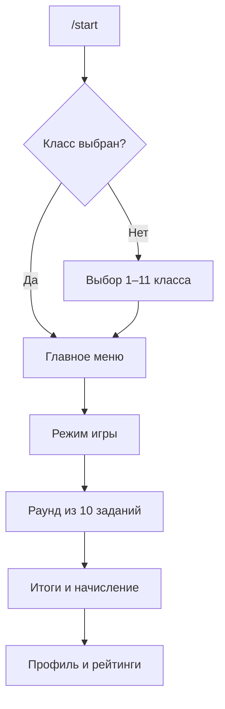
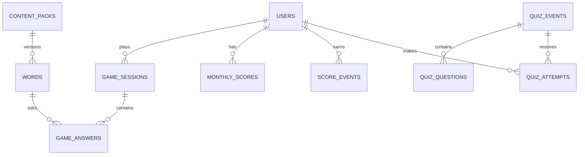

# Архитектура приложения «Кот Учёный»

## Выбор технологий

- **Python 3.10+ / aiogram 3.x.** Асинхронные Router, middleware, dependency
  injection и FSM подходят для пошаговой игры и большого числа параллельных
  диалогов.
- **SQLite + WAL.** На MVP не нужен отдельный сервер БД. Репозитории изолируют
  SQL от обработчиков, поэтому при росте можно заменить реализацию на
  PostgreSQL, не переписывая игровую логику.
- **JSON как исходный формат контента.** Он сохраняет орфограммы, подсказки,
  аудио-ID, теги и варианты ответа. CSV остаётся удобным входным форматом для
  массовой загрузки и преобразуется в JSON.
- **Long polling для первого деплоя.** Проще запустить и диагностировать.
  Webhook подключается при переходе к нескольким экземплярам приложения.

## Модули

```text
src/ortho_game_bot/
├── app.py                 # сборка и запуск приложения
├── config.py              # переменные окружения
├── handlers/              # Telegram-команды и callback-запросы
├── keyboards/             # inline-клавиатуры
├── game/                  # FSM и чистая игровая логика
├── database/              # миграции, модели, репозитории
└── utils/                 # нормализация текста и время
data/words/                # пакеты слов 1–11 классов
tests/                     # unit/integration тесты
```

Обработчики не выполняют SQL напрямую. Они вызывают репозитории и сервисы,
которые передаются через механизм зависимостей aiogram.

## Основной пользовательский поток



## Схема данных



`score_events.idempotency_key` не позволяет одному callback-запросу дважды
начислить очки. `game_answers` хранит снимок правильного ответа: история
останется воспроизводимой даже после выпуска новой версии словаря.

## Ежемесячные рейтинги без удаления истории

Таблица `monthly_scores` имеет составной ключ `(user_id, period_key)`, где период
записан как `2026-09`. Новый месяц автоматически создаёт новую строку. Поле
`users.monthly_score` — быстрый кэш текущего периода, а прошлые результаты
остаются доступны для статистики и наград.

## Архитектура ежемесячной викторины

1. Администратор создаёт `quiz_event` со сроками, диапазоном классов и лимитом
   времени.
2. При планировании система случайно выбирает слова и фиксирует их в
   `quiz_questions`. После старта состав не меняется.
3. Планировщик раз в минуту переводит событие `scheduled → active → closed` и
   ставит уведомления в очередь рассылки.
4. У пользователя только одна попытка (`UNIQUE(quiz_id, user_id)`). Сервер
   проверяет окно времени и длительность, а не доверяет данным клиента.
5. Рейтинг сортируется по баллам, затем по меньшему времени выполнения.

Для одного экземпляра планировщик работает в процессе бота. При горизонтальном
масштабировании он выносится в отдельный worker; SQLite заменяется PostgreSQL,
а блокировки/очередь — Redis. Контракт сервисов остаётся тем же.

## Платные функции в будущем

Бесплатные упражнения не зависят от оплаты. Таблица `user_entitlements` и
будущий `EntitlementService` проверяют доступ к дополнительным режимам,
аналитике или расширенным пакетам. Платёжный провайдер будет адаптером и не
проникнет в игровую логику.

## Игровой контур удержания

Ежедневная активность, лиги, достижения, внешний вид кота и интервальное
повторение ошибок вынесены в отдельные таблицы миграции `002_gamification.sql`.
Это позволяет менять экономику игры независимо от базовых очков и не смешивать
обучающий прогресс с будущими покупками. Полная концепция описана в
[GAMIFICATION.md](GAMIFICATION.md).

## Тестирование

1. **Unit:** нормализация ответов, `е/ё`, начисление баллов, серии и генерация
   вариантов.
2. **SQLite integration:** миграции, CRUD, идемпотентное начисление, рейтинги,
   ограничения викторины.
3. **Handler tests:** синтетические aiogram Update без обращения к Telegram.
4. **End-to-end:** отдельный тестовый бот и закрытая группа пользователей.
5. **Нагрузочный smoke-test:** параллельные ответы, повторные callback и
   имитация рассылки с учётом Telegram rate limits.

## Следующие этапы

- Этап 2 — завершён: устойчивый раунд «Выбери написание», генератор
  дистракторов, антиспам и три вида рейтинга.
- Этап 3: тестовый Telegram-контур через BotFather и серверный деплой.
- Этап 4: визуальное Mini App и диктант с предложением-пропуском/TTS-аудио.
- Этап 5: викторины, планировщик, рассылки и админ-команды.
- Этап 6: мониторинг, нагрузочная проверка и публичный GitHub.
